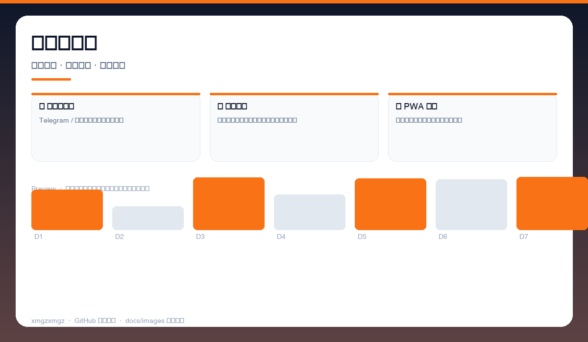
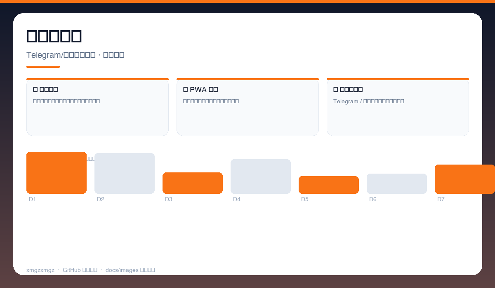
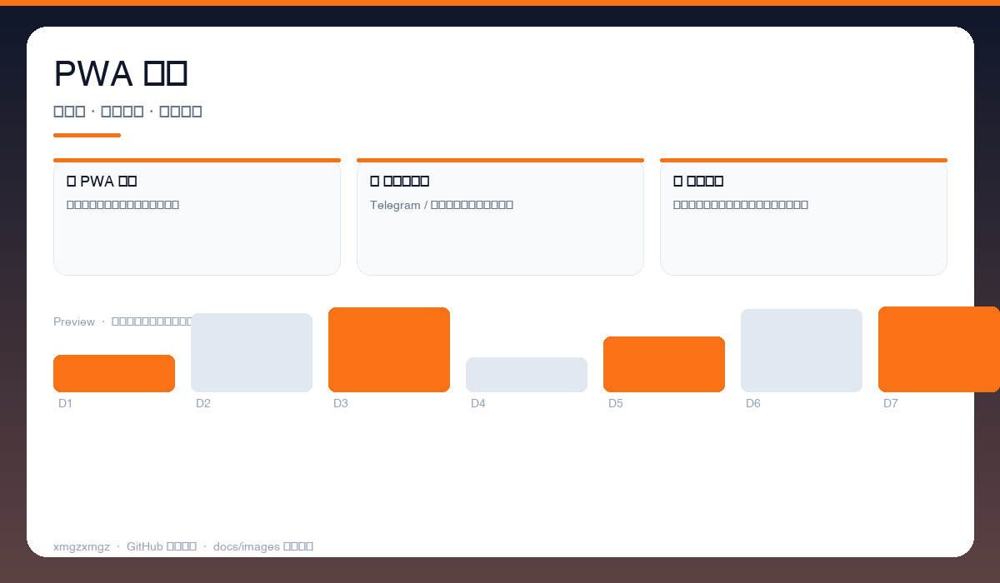

# 🦞 OpenClaw Console — openclaw-console

> 把 AI 助手装进口袋 — 自托管控制台，多渠道消息一处管。

[](https://github.com/xmgzxmgz/openclaw-console)
[](https://github.com/xmgzxmgz/openclaw-console/releases)
[](LICENSE)
[](https://github.com/xmgzxmgz/openclaw-console/actions/workflows/release.yml)

---

## ✨ 功能一览

| 模块 | 能力 | 状态 |
|------|------|------|
| 📡 多渠道接入 | Telegram / 微信消息统一收发与路由 | ✅ |
| 📊 实时监控 | 在线状态、任务队列、资源占用实时看板 | ✅ |
| 📱 PWA 暗色 | 移动端可安装，暗色主题省电护眼 | ✅ |

---

## 📸 功能预览

> 以下为自动生成的示意预览（无需本地部署截图），展示核心功能形态。

| 总览 | 细节 | 流程 |
|------|------|------|
|  |  |  |
| 控制台总览 · 在线状态 · 任务队列 · 资源监控 | 多渠道消息 · Telegram/微信统一收件 · 快捷回复 | PWA 体验 · 可安装 · 离线缓存 · 暗色适配 |

<details>
<summary>查看大图</summary>


</details>

---

## 🚀 快速开始

```bash
npm install
npm run dev
# 浏览器打开 http://localhost:3000，扫码绑定渠道
```

---

## 🛠 技术栈

JavaScript · PWA · WebSocket · Self-hosted · Dark Mode

---

## 🗂️ 目录结构（节选）

```
openclaw-console/
├── docs/images/        # 本 README 的三张自动生成预览图
├── .github/workflows/  # Auto Release 自动发版
├── README.md
└── ...                 # 源码与配置
```

---

## 📦 Releases

本仓库已启用 **Auto Release**（`.github/workflows/release.yml`）：

- 推送 `v*` tag 自动发版：`git tag v0.2.0 && git push origin v0.2.0`
- 手动触发：`gh workflow run "Auto Release" -f version=v0.2.0`（留空则自动 patch +1）
- 变更说明自动生成（`--generate-notes`）

前往 [Releases](https://github.com/xmgzxmgz/openclaw-console/releases) 查看。

---

## 🙏 相关项目

- [workbuddy-account-hub](https://github.com/xmgzxmgz/workbuddy-account-hub) — WorkBuddy 账户中枢（本 README 的样板）
- 更多见 [xmgzxmgz 主页](https://github.com/xmgzxmgz)

---

## 许可

MIT
